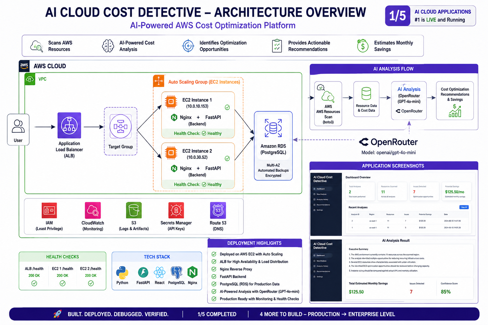
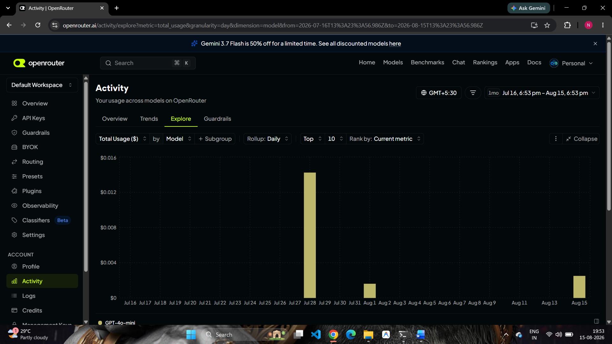
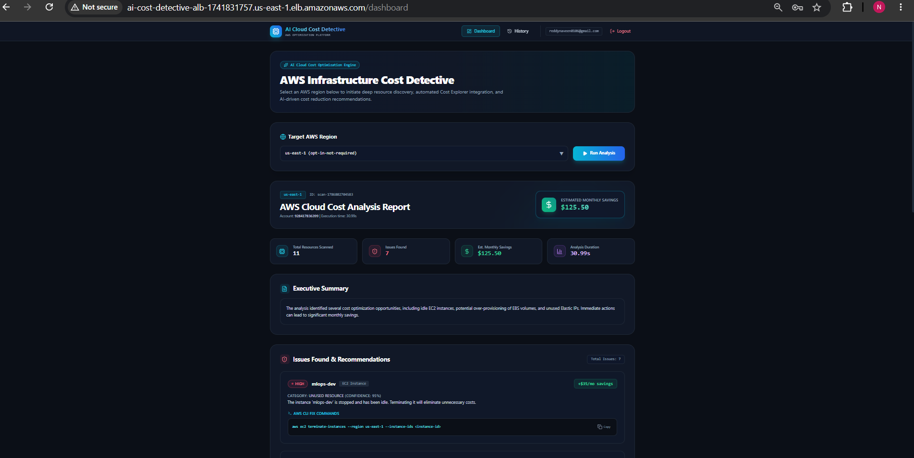
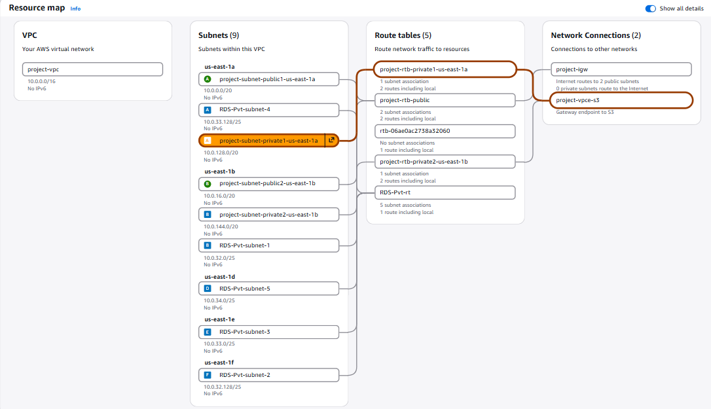
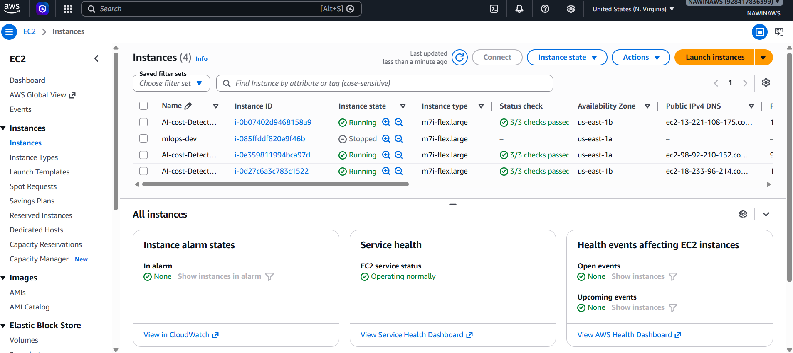
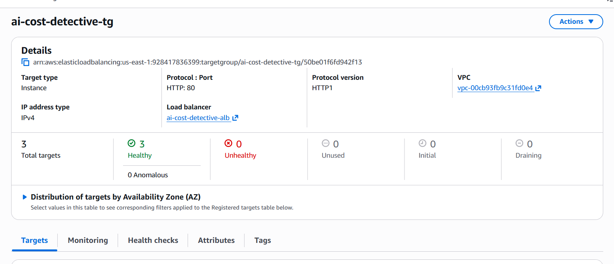

# AI Cloud Cost Optimization

> AI-powered cloud cost analysis and optimization platform for identifying AWS resource inefficiencies and generating actionable cost-optimization insights.


---

## 📌 Project Overview

AI Cloud Cost Optimization is a cloud-focused application designed to analyze AWS infrastructure and identify opportunities for reducing unnecessary cloud expenditure.

The platform combines cloud infrastructure visibility with AI-assisted analysis to help users understand where resources may be inefficient, what could be optimized, and how infrastructure decisions can affect cloud costs.

The project is being developed with a production-oriented architecture using a Python backend, frontend application, Docker containerization, AWS infrastructure, and AI integration.

---

## 🎯 Problem Statement

Cloud infrastructure can become expensive when resources are:

* Over-provisioned
* Under-utilized
* Left running unnecessarily
* Incorrectly configured
* Not monitored regularly
* Deployed without considering cost efficiency

Traditional cloud-cost analysis often requires manually reviewing multiple AWS services and configuration screens.

This project aims to simplify that process by providing a centralized platform for analyzing cloud resources and generating optimization insights.

---

## 💡 Solution

The platform provides a centralized workflow for cloud-cost analysis:

```text
AWS Infrastructure
       │
       ▼
Resource / Cost Data
       │
       ▼
Backend Processing
       │
       ▼
AI-Assisted Analysis
       │
       ▼
Optimization Insights
       │
       ▼
Frontend Dashboard
```

The goal is to move from:

**Cloud resources → raw information → manual investigation**

to:

**Cloud resources → analysis → AI insights → optimization actions**

---

# 🏗️ Architecture

The application follows a layered architecture consisting of the frontend, backend, AI integration, and AWS infrastructure.



### High-Level Architecture

```text
                    ┌──────────────────────┐
                    │       User           │
                    └──────────┬───────────┘
                               │
                               ▼
                    ┌──────────────────────┐
                    │   Frontend Dashboard │
                    └──────────┬───────────┘
                               │
                               ▼
                    ┌──────────────────────┐
                    │    Python Backend    │
                    │      REST APIs       │
                    └──────────┬───────────┘
                               │
                ┌──────────────┼──────────────┐
                │              │              │
                ▼              ▼              ▼
        ┌────────────┐  ┌────────────┐  ┌────────────┐
        │    AWS     │  │     AI     │  │   Cost /   │
        │ Resources  │  │ Integration│  │  Analysis  │
        └────────────┘  └────────────┘  └────────────┘
                │              │              │
                └──────────────┼──────────────┘
                               ▼
                    ┌──────────────────────┐
                    │ Optimization Results │
                    └──────────────────────┘
```

---

# 🚀 Key Objectives

The project focuses on:

* AWS cloud cost visibility
* Resource-level analysis
* Cost inefficiency detection
* AI-assisted recommendations
* Infrastructure awareness
* Cloud networking
* Containerized deployment
* Production-oriented cloud architecture
* Automation opportunities
* Future cost optimization workflows

---

# 🤖 AI Integration

AI is used as an analysis layer to transform infrastructure and cost information into more understandable optimization insights.

The project includes an AI integration layer through OpenRouter.



### AI Workflow

```text
AWS / Application Data
          │
          ▼
     Backend API
          │
          ▼
   Cost Analysis Logic
          │
          ▼
      AI Provider
          │
          ▼
 AI-Generated Insights
          │
          ▼
 Optimization Recommendation
```

The AI layer is intended to assist with:

* Identifying potential cost inefficiencies
* Explaining infrastructure-related cost issues
* Generating optimization suggestions
* Converting technical information into actionable recommendations

---

# 💰 Cost Detection

The cost-detection component focuses on identifying resources or configurations that may contribute to unnecessary cloud expenditure.



The optimization workflow is designed around:

```text
Detect
  ↓
Analyze
  ↓
Explain
  ↓
Recommend
  ↓
Optimize
```

This provides a foundation for building automated FinOps capabilities into the platform.

---

# ☁️ AWS Infrastructure

AWS infrastructure forms the cloud foundation of the application.

The project includes infrastructure components such as:

* VPC
* EC2
* Target Groups
* Application networking
* Load-balancing related components
* Cloud-hosted application services

---

## 🌐 VPC

The application uses AWS networking components to provide controlled communication between cloud resources.



The VPC layer provides the foundation for:

* Network isolation
* Subnet-based resource organization
* Controlled traffic flow
* Secure application deployment
* Future expansion of the cloud architecture

---

## 🖥️ EC2 Infrastructure

EC2 provides compute infrastructure for the application deployment.



The EC2 layer can be used for:

* Running application workloads
* Hosting backend services
* Running containerized workloads
* Supporting production-style deployment experiments

---

## 🎯 Target Groups

Target groups are part of the AWS application networking and load-balancing configuration.



They provide a foundation for:

* Routing traffic to application instances
* Health-check based traffic management
* Load-balancing architecture
* Future horizontal scaling

---

# 🐳 Docker

The application includes Docker support for containerized deployment.

The repository contains a `Dockerfile` and `.dockerignore`, providing the foundation for packaging the application into a reproducible container environment.

### Container Workflow

```text
Application Code
       │
       ▼
   Dockerfile
       │
       ▼
 Docker Image
       │
       ▼
 Docker Container
       │
       ▼
 Application Service
```

### Build

```bash
docker build -t ai-cloud-cost-optimization .
```

### Run

```bash
docker run -d -p 8000:8000 ai-cloud-cost-optimization
```

> Update the exposed port if the backend configuration uses a different application port.

---

# 🧩 Application Components

The project is organized into separate application layers.

```text
AI-cloud-cost-optimization/
│
├── backend/
│   └── Backend application and API logic
│
├── frontend/
│   └── Frontend application
│
├── screenshots/
│   ├── Architecture.PNG
│   ├── Cost_detective.PNG
│   ├── Ec2_Instance.PNG
│   ├── open_router.PNG
│   ├── Target_groups.PNG
│   └── VPC.PNG
│
├── Dockerfile
├── requirements.txt
├── .dockerignore
├── .gitignore
└── README.md
```

---

# 🔌 Backend

The backend is responsible for application logic and communication between the frontend, cloud infrastructure, cost-analysis functionality, and AI integration.

Responsibilities include:

* API processing
* Application logic
* Cloud-resource analysis
* Cost-analysis workflows
* AI integration
* Returning optimization information to the frontend

---

# 🖥️ Frontend

The frontend provides the user-facing interface for interacting with the platform.

The dashboard is intended to provide a centralized view of:

* Cloud resources
* Cost-related information
* Optimization insights
* AI-generated recommendations
* Application status

---

# 🔐 Security Considerations

Cloud cost platforms require careful handling of AWS credentials and infrastructure permissions.

The project follows the principle that sensitive credentials should **not** be hard-coded into application source code.

Recommended production practices include:

* AWS IAM roles instead of hard-coded access keys
* Least-privilege IAM policies
* Environment variables for application secrets
* Secure API credentials
* Restricted security-group rules
* Private networking where appropriate
* HTTPS for production traffic
* Secret-management solutions for sensitive configuration

### Important

Never commit:

```text
.env
AWS Access Keys
AWS Secret Keys
API Keys
Passwords
Private Keys
```

to the repository.

---

# 📊 Cloud Cost Optimization Workflow

The overall optimization workflow can be represented as:

```text
             AWS Environment
                    │
                    ▼
             Resource Discovery
                    │
                    ▼
              Cost Analysis
                    │
                    ▼
             Cost Detection
                    │
                    ▼
              AI Analysis
                    │
                    ▼
        Optimization Recommendations
                    │
                    ▼
             Human Decision
                    │
                    ▼
             Optimization Action
```

The platform is designed so that future versions can extend this workflow toward automated remediation.

---

# 📸 Project Screenshots

## Architecture


---

## Cost Detection


---

## EC2 Infrastructure


---

## OpenRouter AI Integration


---

## AWS Target Groups


---

## AWS VPC


---

# 🛠️ Technology Stack

| Layer              | Technology                     |
| ------------------ | ------------------------------ |
| Cloud              | AWS                            |
| Compute            | Amazon EC2                     |
| Networking         | Amazon VPC                     |
| Traffic Management | Target Groups / Load Balancing |
| Backend            | Python                         |
| Frontend           | Web Application                |
| AI Integration     | OpenRouter                     |
| Containerization   | Docker                         |
| Version Control    | Git / GitHub                   |

---

# ⚙️ Local Development

## 1. Clone the Repository

```bash
git clone https://github.com/reddynaveen0106-boop/AI-cloud-cost-optimization.git
```

## 2. Enter the Project

```bash
cd AI-cloud-cost-optimization
```

## 3. Create a Python Virtual Environment

```bash
python -m venv venv
```

### Windows

```bash
venv\Scripts\activate
```

### Linux / macOS

```bash
source venv/bin/activate
```

## 4. Install Dependencies

```bash
pip install -r requirements.txt
```

## 5. Configure Environment Variables

Create a `.env` file for local development when required.

Example:

```env
OPENROUTER_API_KEY=your_api_key
```

Use the actual environment variables required by the backend implementation.

## 6. Start the Backend

Run the backend using the project's configured application entry point.

## 7. Start the Frontend

Navigate to the frontend directory and run the frontend using its configured development command.

---

# 🐳 Docker Deployment

The application can be packaged using Docker.

```bash
docker build -t ai-cloud-cost-optimization .
```

Run the container:

```bash
docker run -d \
  --name ai-cloud-cost-optimization \
  -p 8000:8000 \
  ai-cloud-cost-optimization
```

Verify:

```bash
docker ps
```

View logs:

```bash
docker logs ai-cloud-cost-optimization
```

---

# ☁️ AWS Deployment Concept

A production deployment can follow this model:

```text
                  Internet
                     │
                     ▼
              Load Balancer
                     │
                     ▼
               Target Group
                     │
             ┌───────┴───────┐
             ▼               ▼
          EC2 #1           EC2 #2
             │               │
             └───────┬───────┘
                     ▼
              Application
                     │
          ┌──────────┴──────────┐
          ▼                     ▼
      AWS Services          AI Provider
          │                     │
          └──────────┬──────────┘
                     ▼
             Cost Optimization
```

This architecture can be extended with additional AWS services as the platform moves toward a more enterprise-ready implementation.

---

# 🔄 Git Workflow

Recommended development workflow:

```text
Feature Branch
      │
      ▼
Development
      │
      ▼
Testing
      │
      ▼
Git Commit
      │
      ▼
Pull Request
      │
      ▼
Code Review
      │
      ▼
Main Branch
      │
      ▼
Deployment
```

Example:

```bash
git checkout -b feature/cost-analysis
```

```bash
git add .
```

```bash
git commit -m "Add cloud cost analysis improvements"
```

```bash
git push origin feature/cost-analysis
```

---

# 🧪 Testing

Testing should cover:

* Backend API functionality
* Frontend functionality
* AWS resource access
* Cost-analysis logic
* AI integration
* Docker container startup
* Network connectivity
* Authentication and authorization
* Error handling

---

# 📈 Future Roadmap

The project is designed to evolve toward a more complete AI-powered FinOps platform.

### Phase 1 — Foundation

* [x] AWS infrastructure
* [x] Python backend
* [x] Frontend
* [x] Docker support
* [x] AI integration
* [x] Cost-detection workflow
* [x] AWS networking setup

### Phase 2 — Cloud Intelligence

* [ ] AWS Cost Explorer integration
* [ ] AWS resource discovery automation
* [ ] Resource utilization analysis
* [ ] Cost anomaly detection
* [ ] Historical cost analysis
* [ ] Cost forecasting

### Phase 3 — AI Optimization

* [ ] AI-generated optimization recommendations
* [ ] Resource right-sizing recommendations
* [ ] Idle-resource detection
* [ ] Automated cost explanations
* [ ] Optimization priority scoring

### Phase 4 — Automation

* [ ] AWS Lambda automation
* [ ] Automated EC2 stop/start workflows
* [ ] Scheduled optimization jobs
* [ ] Approval-based remediation
* [ ] Automated cleanup workflows

### Phase 5 — Enterprise FinOps

* [ ] Authentication and authorization
* [ ] Multi-account AWS support
* [ ] Cost allocation by team/project
* [ ] Budget alerts
* [ ] Governance policies
* [ ] Audit logging
* [ ] CloudWatch monitoring
* [ ] Production CI/CD
* [ ] Infrastructure as Code with Terraform

---

# 🎯 Project Goals

The long-term goal is to build a platform capable of helping organizations:

* Understand cloud expenditure
* Identify inefficient infrastructure
* Reduce unnecessary AWS costs
* Make data-driven infrastructure decisions
* Use AI to explain cloud-cost problems
* Automate repetitive optimization tasks
* Establish better FinOps practices

---

# 📚 Skills Demonstrated

This project provides practical exposure to:

* AWS Cloud
* EC2
* VPC
* Load Balancing
* Target Groups
* Cloud networking
* Python backend development
* REST API architecture
* AI API integration
* Docker
* Git
* GitHub
* Cloud cost optimization
* Infrastructure troubleshooting
* Production deployment concepts

---

# 👨‍💻 Project Status

**Current Status:** Active Development

The project is being progressively developed from a cloud-cost analysis application toward a production-oriented AI-powered FinOps platform.

---

# 📄 License

This project is intended for educational, portfolio, and development purposes.

---

## ⭐ Project Vision

> Build an AI-powered cloud optimization platform that can continuously understand cloud infrastructure, detect unnecessary spending, explain the reason behind the cost, and recommend or automate the right optimization action.

---
